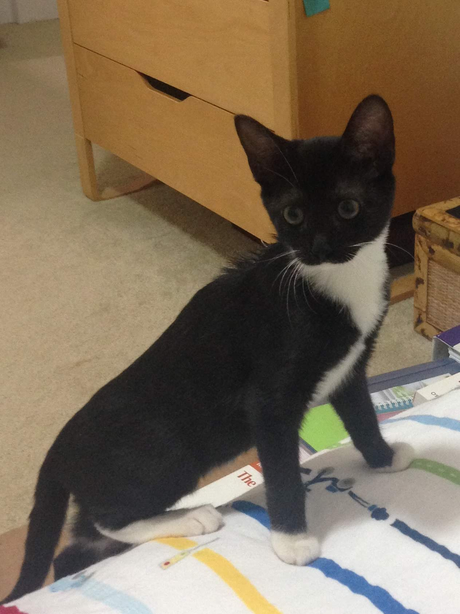
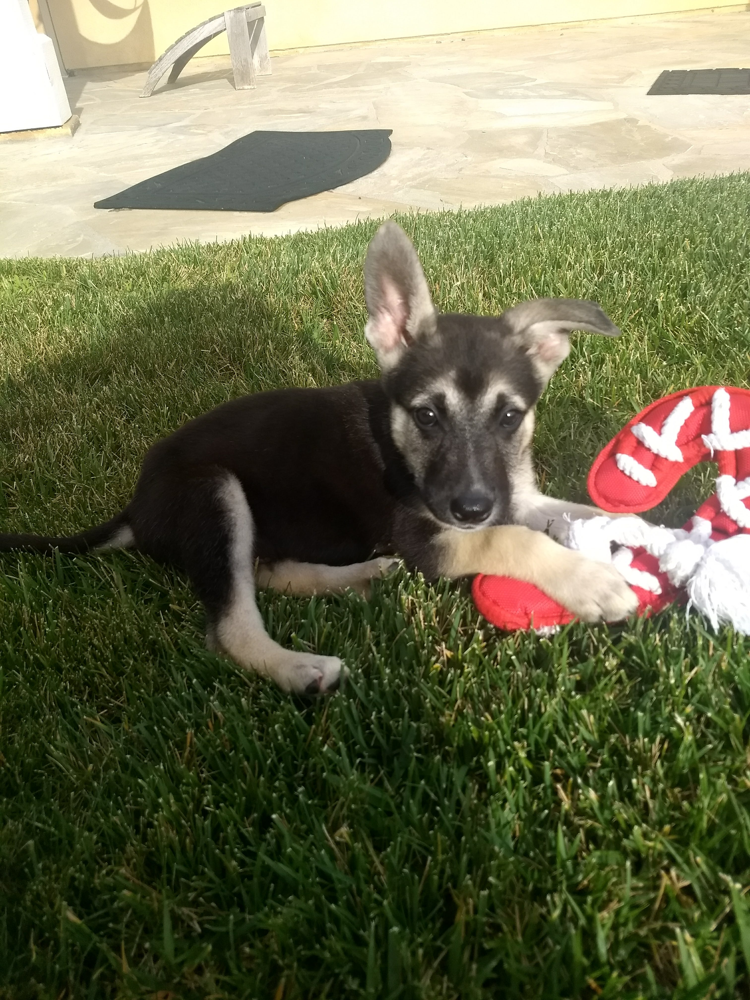

[Introduction](#introduction)

[Academics](#academics)

[Extracurriculars](#extracurriculars)

### Introduction

Hi! I'm **Aneesha Ramaswamy**, a second-year studying Computer Science and Studio Arts at UCSD. 

### Academics

I am currently taking various CSE classes along with studio drawing classes. These classes have enabled me to solve advanced problems such as making sure the world is aware I can code:
```
print("Hello World")
```
Aside from classwork, I am also doing research at the Berg Lab in computer vision to help develop an Optical Character Recognition system. In balancing this coursework and research, my professors have consistently given the advice to 
> Start early, start often.
You can see more about my academic interests [here](www.linkedin.com/in/aneesha-ramaswamy).

### Extracurriculars

Outside of academics, I have many interests that I enjoy including: 
- playing piano
- watercolor painting
- reading

This year, I also have a couple goals I'd like to achieve:
- [x] start journaling
- [ ] learn to play piano by ear
- [ ] learn french

I also occasionally foster dogs and cats which is always a lot of fun.

